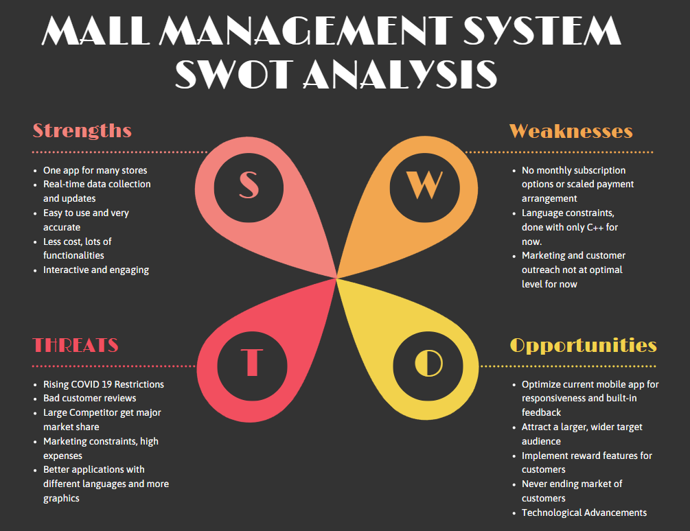

# REQUIREMENTS
The Mall management system helps the user to do the following things if he or she wants to visit a mall for shopping or other leisure activities.
* Shoppi-buddy -> A Shopping Assistant system that allows the user to select items and add them to cart, tells the user which isle the items are placed in, the total cost, discounted items and many other functionalities as mentioned below. (By Abhishek R Shankar (99005016))
* 
* 
* 
* 

# RESEARCH

## 1. Shoppi Buddy (A shopping assistant application)
A recent research on this topic has uncovered the fact that there are systems that provide the option for online shopping when it comes to groceries, house hold items and other stuff as well and some systems also have the functionality to make automated, audiobased shoppping lists for people to refer to when they go for shopping. This system, in its unique fuctionality, brings forward a series of activities that are essential for the people who prefer to go to shop for groceries or anything physically. The system provides a wide range of functionalities for the users to make use of from making lists of the stuff they want to buy to calculating and pointing out stuff that is on discount, position of the items in the shopping complex and also automatically calculates the best path to take in case a person chooses a lot of items and is in a hurry as we all are these days. Hence, Shoppi-Buddy helps everyone who wants to go for household or grocery shopping to huge shopping complexes or malls.

## 2. 

## 3. 

## 4. 

## 5. 

# COST AND FUNCTIONS

## 1. Shoppi Buddy 
Since the application will be created using C++ language and other open source tools, the cost of developing the application is zero rupees. The only major costs involved will come into play once the system is ready to be used. Usually apps like this cost a lot when they as for membership and other things. The system has the following functionalities: 

|Feature | Description |
| ------ | ----------------------------------------- |
|`F1`    | The system automatically checks for different stores nearby and dispays the waiting time for each store |
|`F2`    | Once a user chooses a store, the system displays the category of items present in the store for the user to select stuff from |
|`F3`    | For each category, all the relevant shopping items are displayed and the user can choose any item to add into the cart |
|`F4`    | For each item, the system shows the position of that item in the shopping complex (Aisle number), expiry date, cost, discount offered, availability, category and billing details |
|`F5`    | The system also calculates the shortest route for the shopper to travel in the shopping complex in order to get all the items in minimum time |
|`F6`    | The system calculates and sorts the items based on discount, aisle positions, category and expiry date for the user to check before buying the item |
|`F7`    | The system displays each item selected by the user and calculates the total cost of the cart based on all the discounted values and shows the user if any item selected by him or her has already expired or is going to expire anytime soon |
|`F8`    | Once the user is done shopping, the system provides information about billing counter based on number of items chosen by the user, queue length at the billing counter and availability of the counters | 

The system designed is very cost effective as it integrates all the underlying factors and is very cost effective when it comes to shopping assistance.

## 2. 

## 3. 

## 4. 

## 5.

# SWOT ANALYSIS

# 4Ws and 1H
## WHO

## WHAT

## WHEN

## WHERE

## HOW

# DETAILED REQUIREMENTS
## HIGH LEVEL REQUIREMENTS (HLR)
|  ID   | Description |  Category   | Status | 
| ----- | ----------- | ----------- | -------|
| HLR01 | The user shall be able to select which store he or she want to go to for shopping |  Requirement  |  TBD    |
| HLR02 | The user shall be able to select which category he or she wants to shop from and all the categories for the particular store will be displayed for the user | Requirement | TBD |
| HLR03 | The user shall be able to add items to the cart and see all the relevant details for the items like cost, aisle number etc and add items accordingly | Requirement | TBD |
| HLR04 | The user shall be able to get an online bill with all the calculations and comparison from other stores as well | Scenario | TBD |
| HLR05 | The user shall select which billling counter he or she wants to go to based on the number of items, queue and other conditions | Scenario | TBD |
| HLR06 | The user shall utilize item description, automatic sorting based on aisle location, discount values, cost and other features | Boundary | TBD |
| HLR07 | The user shall choose their method of navigation from the Mall-Navi main menu|Requirement|TBD|
| HLR08 | The user shall be provided with parameters for travel to an immediate destination|Requirement|TBD|
| HLR09 | The user shall be provided total distance to be covered as per their current explore plan|Scenario|TBD|
| HLR10 | The user shall be provided with total time for their current explore plan|Scenario|TBD|
| HLR11 | Mall admin shall be able to add or remove a store|Requirement|TBD|

## LOW LEVEL REQUIREMENTS (LLR)
|  ID   | Description |  Category   | High Level ID | Status | 
| ----- | ----------- | ----------- | ------------- | ------ |
| LLR01 | The user shall be able to select the store he or she wants to go to based on number or people in waiting or in the store | Requirement | HLR01 |   TBD  |
| LLR02 | The user shall be able to select the store he or she wants to go to based on number of discounted items and total bill discount provided by the store | Requirement | HLR01 | TBD |
| LLR03 | The user shall be able to select the store he or she wants to go to based on the category from which he or she wants to buy things | Scenario |  HLR01 | TBD |
| LLR04 | The user shall be able to select the category and see what items are present in the store for that category | Requirement | HLR02 | TBD |
| LLR06 | The user shall be alble to select items from a category based on availability and user requirement | Requirement | HLR02 | TBD |
| LLR07 | The user shall be able to sort the items based on cost | Boundary | HLR03, HLR06 | TBD |
| LLR08 | The user shall be able to sort the items based on aisle number to reduce the distance travelled in the shop | Scenario | HLR03, HLR06 | TBD |
| LLR09 | The user shall be able to sort the itmes based on discount values for each item | Requirement | HLR03, HLR06 | TBD |
| LLR10 | The user shall be able to check the expiry dates for the itmes close to expiry and choose accordingly | Boundary | HLR03, HLR06 | TBD |
| LLR11 | The user shall be able to get an online mock bill with total cost and items displayed in a sorted manner | Requirement | HLR04 | TBD |
| LLR12 | The user shall be able to get an online bill with the real vs discounted prices for all the stores for the selected items | Scenario | HLR04 | TBD |
| LLR13 | The user shall be able to get benefits and more discount if he or she is a store member | Scenario | HLR04 | TBD |
| LLR14 | The user shall select the billing counter based on number of items in the cart (Some billing counters are for less number of items, some are for more) | Scenario | HLR05 | TBD |
| LLR15 | The user shall be able to select the billing counter based on queue size near the counter | Scenario | HLR05 | TBD |
| LLR16 | The user shall be able to select the billing counter based on payment options (Cash, card or UPI) | Scenario | HLR05 | TBD |
| LLR17 | The user shal be able to select or deselct items near the billing counter as final adjustments to the budget | Boundary | HLR03, HLR06 | TBD |
| LLR18 | The user shall be able to change the store in between if the number of people in the store decreases or other store is offering more discount | Requirement | HLR01, HLR02 | TBD |
| LLR19 | User choice shall be accepted from the main menu|Requirement |HLR07|TBD|
| LLR20 | CSV file shall be read for store names and locations|Requirement |HLR07|TBD|
| LLR21 | User current location and destination shall be recorded|Requirement |HLR08|TBD|
| LLR22 | Time to commute from current location to destination directly shall be calculated|Scenario|HLR08|TBD|
| LLR23 | Shortest distance from current location to destination directly shall be calculated|Scenario|HLR08|TBD|
| LLR24 | User choice regarding mall floor to be explored shall be recorde|Scenario|HLR09|TBD|
| LLR25 | User current location and all stop points till destination shall be recorded|Requirement|HLR09|TBD|
| LLR26 | Distance to be covered in current plan shall be calculated|Scenario|HLR09|TBD|
| LLR27 | Tentative time taken to complete current plan shall be calculated|Scenario| HLR10|TBD|
| LLR28 | Shop will be added or removed as per Mall admin's choice|Requirement| HLR11|TBD|

